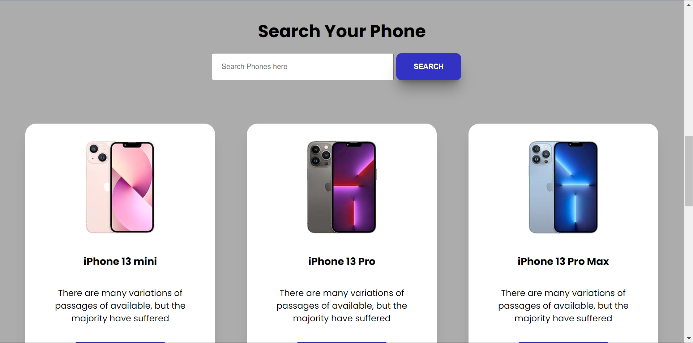
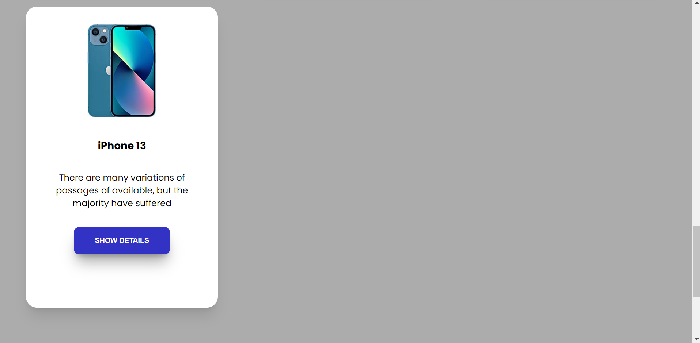

# Hot Gadgets - Phone Search Platform






## Overview

Hot Gadgets is a dynamic phone search platform designed to help users quickly and easily find detailed information about various smartphones. With a user-friendly interface and powerful search capabilities, this platform allows users to explore a wide range of phones, view detailed specs, and make informed decisions.

## Features

- **Search Functionality**: Users can search for specific phones by name, and the platform will filter and display relevant results.
- **View Phone Details**: Each phone card includes a "Show Details" button that opens a modal window with comprehensive information about the selected phone, including storage, display, chipset, memory, sensors, and release date.
- **Default Phone Cards**: The platform displays a set of default phone cards upon loading, allowing users to browse through popular models.
- **Show More Functionality**: Users can expand the list of displayed phones by clicking the "Show More" button to see additional results.
- **Responsive Design**: The site is fully responsive, ensuring a seamless experience across all devices.

## JavaScript Functionality

The project leverages several JavaScript functions to accomplish the task:

1. **Search Functionality**: 
   - A `searchPhones()` function is used to fetch and filter phones based on user input. This function listens for the search event, captures the input, and dynamically updates the displayed results.

2. **Displaying Phone Details**:
   - The `showDetails()` function is triggered when a user clicks on the "Show Details" button. This function fetches detailed information about the selected phone and displays it in a modal window.

3. **Default and Expanded Phone Cards**:
   - The `loadPhones()` function initially loads a set of default phone cards. The `showMorePhones()` function is then used to display additional phones when the user clicks the "Show More" button.

4. **Modal Management**:
   - Functions like `openModal()` and `closeModal()` are used to manage the modal windows, ensuring smooth transitions when viewing detailed information about a phone.

5. **Event Listeners**:
   - Various event listeners are attached to buttons and form elements to capture user interactions and trigger the corresponding JavaScript functions.

## Live Demo

Check out the live version of the project here: [Hot Gadgets - Phone Search Platform](https://elixirpoison.github.io/PhoneHuntingAPI/)

## How to Use

1. Clone the repository to your local machine:
   ```bash
   git clone https://github.com/elixirpoison/PhoneHuntingAPI.git
